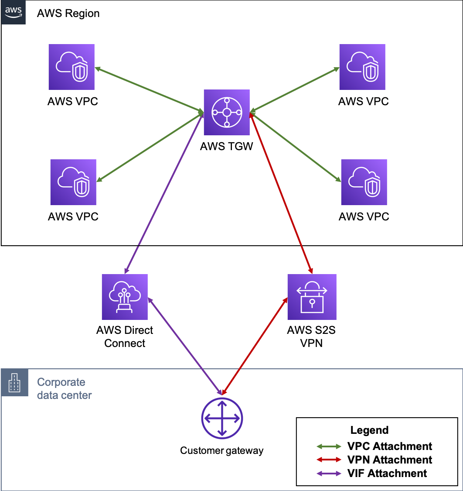
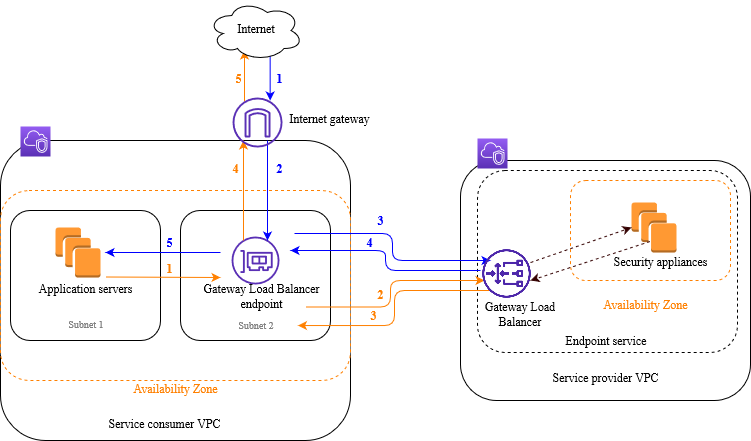

Before diving into the reference architecture for this workshop, let's review core AWS networking concepts.

**AWS Virtual Private Cloud (VPC)** is a logically isolated section of the AWS Cloud where you can launch AWS resources in a virtual network that you define. You have complete control over your virtual networking environment, including selection of your own IP address range, creation of subnets, and configuration of route tables and network gateways.

**Availability zones (AZ)** are multiple, isolated locations within each Region that have independent power, cooling, physical security, etc. A VPC spans all of the AZs in the Region.

**Region**, is a collection of multiple regional AZs in a geographic location. The collection of AZs in the same region are all interconnected via redundant, ultra-low-latency networks.

All **subnets** within a VPC are able to reach each other with the default or intrinsic router within the VPC. All resources in a subnet use the intrinsic router (1st host IP in each subnet) as the default gateway. Each subnet must be associated with a VPC route table, which specifies the allowed routes for outbound traffic leaving the subnet.

An **Internet Gateway (IGW)** is a horizontally scaled, redundant, and highly available VPC component that allows communication between instances in your VPC and the internet. It therefore imposes no availability risks or bandwidth constraints on your network traffic.

**AWS NAT Gateway (NAT GW)** is a Network Address Translation (NAT) service. You can use a NAT gateway so that instances in a private subnet can connect to services outside your VPC but external services cannot initiate a connection with those instances.

**AWS Transit Gateway (TGW)** is a highly scalable cloud router that connects your VPCs in the same region to each other, to on-premise networks, and even to the internet through one hub. With the use of multiple route tables for a single TGW, you can design hub and spoke routing for traffic inspection and enforcement of security policy across multiple VPCs.

**AWS (Gateway Load Balancer (GWLB)** is a transparent network gateway that distributes traffic (in a 3/5 tuple flow aware manner) to a fleet of virtual appliances for inspection. This is a regional load balancer that uses GWLB endpoints (GWLBe) to securely intercept data plane traffic within consumer VPCs in the same region.  

In this workshop we will use all these components to test FortiGate Autoscale in an enterprise design. 
